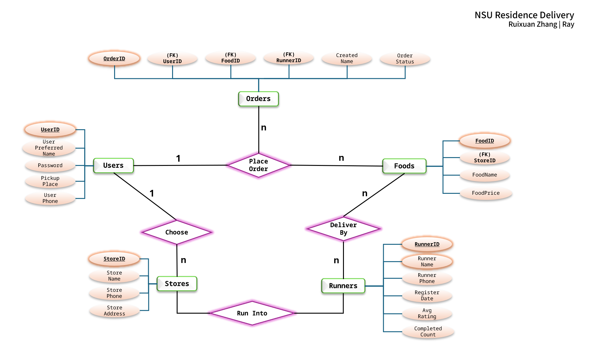

# NSU Residence Delivery – Relational Database System

**Author:** Ruixuan Zhang (Ray)  
**Course:** CS 4343 Database Management Systems  
**Instructor:** Professor Alrifai  
**Date:** April 2025

---

## Overview

NSU Residence Delivery is a relational database system designed to simulate a campus-wide food delivery platform for Northeastern State University (NSU).  
The project models a realistic multi-entity environment that involves users, campus dining stores, food menus, student runners, and order records.

The goal of this system is to demonstrate end-to-end database design, including:

- entity–relationship modeling
- schema design and normalization
- foreign key constraints
- data population with realistic sample entries
- SQL-based data retrieval using multi-table joins, nested queries, and aggregations

This project was developed as part of the “Database Design and Implementation” option for CS 4343.

---

## Features

The system supports the following core functionalities:

- Maintain user profiles and residence pickup locations
- Manage dining stores available on campus
- Provide store-specific food menus
- Track student runners who deliver orders
- Record food orders with timestamps and delivery status
- Query statistical information such as most ordered food, average food price per store, new runners with no ratings, etc.

---

## Entity–Relationship (ER) Diagram

The conceptual schema consists of **five main entities**: Users, Stores, Foods, Runners, and Orders. Their relationships capture how students place orders, how foods belong to stores, and how runners deliver meals.

---

## Database Schema Summary

### **1. Users**

Represents the students using the delivery system.  
Attributes include preferred name, password policy, residence hall, and phone number.

### **2. Stores**

Represents campus dining options such as Chickfila, Pizza Hut, Señor Sabroso, etc.

### **3. Foods**

Menu items offered by each store.  
Linked to `Stores` through the foreign key `StoreID`.

### **4. Runners**

Student runners responsible for delivering food.  
Includes optional fields for rating and completed delivery count.

### **5. Orders**

A complete order record linking:

- the user who placed the order
- the food item selected
- the runner who delivered it
- the timestamp
- the order status (Delivered, Delivering, OrderPlaced)

The system enforces referential integrity across all foreign keys.

---

## How to Run This Project

1. Open Microsoft SQL Server
2. Run `schema.sql` to create the database and tables
3. Run `data.sql` to populate the system with realistic sample data
4. Run `queries.sql` to test data relationships and analytics

All scripts are independent and can be run sequentially.

---

## Example Queries Included

`queries.sql` demonstrates:

- Users grouped by pickup residence
- Average food price by dining store
- What each user ordered
- Foods offered at each store
- Runners with no rating or delivery history
- Foods containing “Chicken”
- Users with digit ‘5’ in their names
- Complete order listings (user–food–runner)
- Most frequently ordered food
- Stores with zero orders

These queries intentionally cover JOIN, GROUP BY, nested SELECT, sorting, and filtering operations.

---

## Design Rationale

This project was inspired by the need for a more integrated and student-friendly campus delivery experience.  
My goal was to design a clean and normalized relational model that:

- reflects real-world interactions among users, stores, foods, and runners
- supports expansion toward full-stack implementation
- ensures maintainability through clear entity boundaries
- enforces data reliability using constraints and foreign keys

The database can be easily extended into a full application with modules for payment, real-time delivery tracking, or order analytics.

---

## Summary

This project demonstrates fundamental skills in:

- Relational schema design
- SQL implementation
- ER modeling
- Data consistency and validation
- Querying and data analysis
- Realistic system abstraction

Although built for coursework, the database architecture is designed with real-world scalability and extension in mind, serving as a solid foundation for future full-stack or data engineering projects.

---

## Contact

If you would like more information, feel free to contact:  
**Ruixuan Zhang**  
zhang14@nsuok.edu
